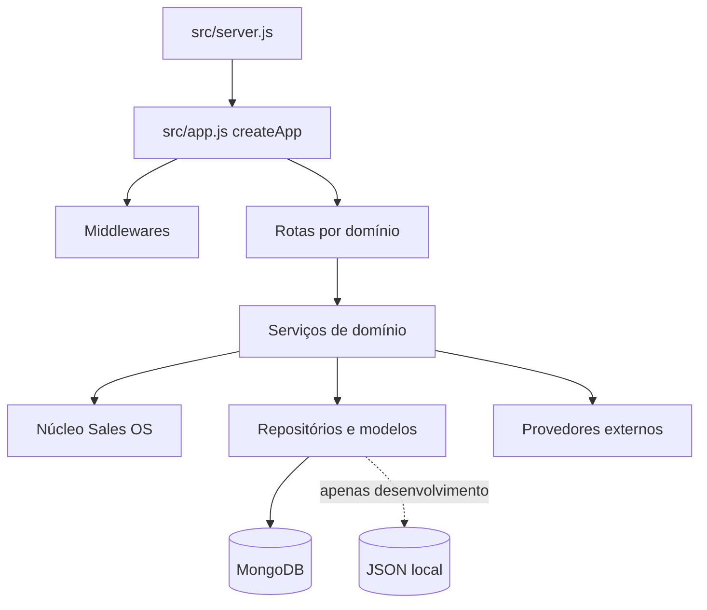
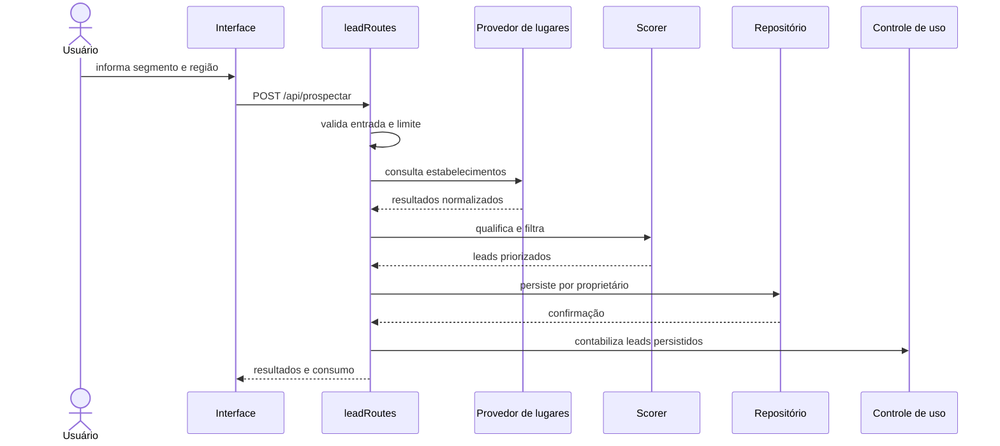

# Arquitetura do LeadHunter Pro

## 1. Visão geral

A aplicação adota uma arquitetura em camadas com composição explícita. O objetivo é impedir que detalhes de HTTP, persistência e integrações externas contaminem regras comerciais reutilizáveis.

## 2. Responsabilidades

### `src/server.js`

Ponto de entrada. Carrega ambiente, conecta persistência, cria a aplicação e abre a porta. Não define rotas nem regras de negócio.

### `src/app.js`

Implementa o padrão Application Factory. Configura Helmet, CORS, parser JSON, logging, rate limit e composição das rotas. Não inicia o servidor.

### `src/routes/`

Adapta o protocolo HTTP aos serviços:

- `systemRoutes.js`: páginas, saúde e diagnóstico;
- `billingRoutes.js`: consumo, checkout e reconciliação;
- `leadRoutes.js`: prospecção, CRM e exportação;
- `adminRoutes.js`: usuários, planos, segurança, auditoria e reinicialização controlada;
- `commercialRoutes.js`: campanhas, agenda, propostas, clientes e relatórios.

### `src/services/`

Contém regras comerciais, construção de relatórios, geração de campanhas, propostas, billing e integrações. Serviços devem ser independentes do DOM.

### `src/core/`

Núcleo do Sales OS: copiloto, memória, prompts, automação e inteligência. Deve permanecer desacoplado das rotas legadas.

### Persistência

- MongoDB/Mongoose: modo obrigatório em produção;
- JSON local: fallback permitido somente em desenvolvimento autorizado;
- `jsonFileStore.js`: escrita atômica e serialização para reduzir corrupção.

### Interface

`public/` contém páginas estáticas e controladores JavaScript. `public/app.js` ainda é um controlador legado amplo; está organizado por seções e registrado como dívida técnica de redução incremental.

## 3. Fluxo de uma prospecção

## 4. Fluxo de autorização

1. O cliente envia JWT no cabeçalho `Authorization`.
2. `requireAuth` verifica assinatura, emissor e audiência.
3. O usuário é recarregado da persistência.
4. Conta suspensa ou inexistente é rejeitada.
5. Rotas administrativas aplicam `requireAdmin`.
6. Consultas de domínio sempre recebem o identificador do proprietário.

## 5. Dependências externas

| Dependência | Uso | Falha esperada |
|---|---|---|
| MongoDB | persistência de produção | bootstrap falha quando obrigatório |
| Google Places | busca de estabelecimentos | erro controlado e diagnóstico admin |
| Mercado Pago | checkout e assinatura | nenhum plano pago é ativado sem validação |
| Resend | recuperação de senha | fallback de desenvolvimento sem expor token em produção |
| Provedor de IA | textos comerciais | fallback local determinístico |

## 6. Decisões arquiteturais

As decisões relevantes ficam em `docs/decisoes/` e não devem ser alteradas silenciosamente. Uma nova decisão estrutural deve gerar um novo ADR.

## Vocabulário centralizado do funil

A partir da versão 23.7.1, `src/domain/leadStatus.js` é a fonte única de verdade das etapas comerciais. Serviços não devem criar nomes próprios de status. Intenções como “qualificando” e eventos como “respondeu” pertencem à timeline de interações; a posição do lead deve usar exclusivamente as etapas descritas em `docs/FUNIL_COMERCIAL.md`.

## 7. Reinicialização administrativa

`databaseResetService.js` concentra a política destrutiva fora da camada HTTP. A rota apenas autentica, repassa a solicitação e grava o recibo de auditoria. O serviço opera por adaptadores para MongoDB e JSON local, exige reautenticação e preserva todas as contas administrativas.

A exclusão é ordenada: dados operacionais primeiro e usuários comuns por último. Em instalações MongoDB sem replica set, essa estratégia oferece repetibilidade e preservação do acesso administrativo mesmo sem transações multidocumento.
