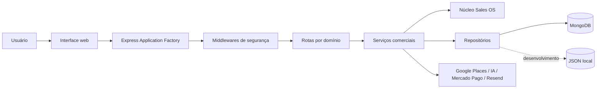

# LeadHunter Pro: sistema web para prospecção e gestão comercial

> **Autor:** [preencher]  
> **Instituição:** [preencher]  
> **Curso:** [preencher]  
> **Orientador(a):** [preencher]  
> **Cidade:** [preencher]  
> **Ano:** 2026

## Resumo

Este trabalho apresenta o desenvolvimento do LeadHunter Pro, uma aplicação web no modelo software como serviço destinada à prospecção de estabelecimentos, qualificação de leads e organização do processo comercial. O sistema reúne autenticação, CRM visual, geração assistida de abordagens, campanhas, follow-ups, relatórios, planos de assinatura e administração de usuários. A implementação utiliza Node.js, Express, JavaScript, MongoDB e uma interface web sem framework. A metodologia adotada combina desenvolvimento incremental, separação de responsabilidades, testes automatizados e controles de segurança baseados em ameaças recorrentes de aplicações web. Como resultado, foi construída uma arquitetura modular capaz de operar com persistência MongoDB e, somente em desenvolvimento autorizado, armazenamento JSON local. O projeto também incorpora rastreabilidade de requisitos, registro de decisões arquiteturais e critérios de validação reproduzíveis.

**Palavras-chave:** prospecção comercial; CRM; software como serviço; Node.js; segurança web.

## Abstract

This work presents LeadHunter Pro, a software-as-a-service web application designed for business prospecting, lead qualification, and sales process organization. The system combines authentication, a visual CRM, assisted outreach generation, campaigns, follow-ups, reports, subscription plans, and user administration. The implementation uses Node.js, Express, JavaScript, MongoDB, and a framework-free web interface. The adopted methodology combines incremental development, separation of concerns, automated testing, and security controls based on common web application threats. The resulting architecture supports MongoDB persistence and, only in authorized development environments, local JSON storage. Requirements traceability, architectural decision records, and reproducible validation criteria are also included.

**Keywords:** sales prospecting; CRM; software as a service; Node.js; web security.

## 1. Introdução

Pequenos negócios e profissionais autônomos frequentemente executam a prospecção de forma fragmentada, utilizando planilhas, mensagens isoladas e anotações sem histórico centralizado. Essa condição reduz a previsibilidade do funil e dificulta a priorização de oportunidades. O LeadHunter Pro foi concebido para reunir busca, qualificação, abordagem e acompanhamento em um único fluxo.

### 1.1 Problema de pesquisa

Como estruturar uma aplicação web de prospecção comercial que seja compreensível, segura, testável e adequada tanto à demonstração acadêmica quanto à evolução para um produto SaaS?

### 1.2 Objetivo geral

Desenvolver uma plataforma web que auxilie a descoberta, qualificação e gestão de leads, preservando separação de responsabilidades, segurança e rastreabilidade técnica.

### 1.3 Objetivos específicos

- autenticar usuários e isolar seus dados;
- consultar e normalizar estabelecimentos;
- atribuir uma pontuação comercial explicável;
- organizar leads em um pipeline visual;
- apoiar abordagens, campanhas e follow-ups;
- controlar limites e planos de assinatura;
- oferecer administração e auditoria;
- verificar regras críticas por testes automatizados;
- documentar requisitos, arquitetura e decisões.

## 2. Fundamentação técnica

A arquitetura segue princípios de modularidade e responsabilidade única. A camada HTTP interpreta requisições; serviços aplicam regras comerciais; repositórios persistem entidades; middlewares tratam aspectos transversais como autenticação e limitação de requisições. O padrão Application Factory desacopla a criação da aplicação da abertura da porta de rede. A segurança é tratada em profundidade por autenticação JWT, autorização por papel, CSP, CORS, rate limit, validação de URLs públicas e isolamento por proprietário.

## 3. Metodologia

Foi adotada uma abordagem de engenharia incremental:

1. levantamento de funcionalidades e riscos;
2. identificação de contratos existentes por testes;
3. correção de falhas funcionais e de segurança;
4. refatoração estrutural sem alteração intencional do comportamento;
5. criação de documentação e rastreabilidade;
6. execução de validações estáticas e automatizadas;
7. empacotamento sem dados sensíveis.

A avaliação combina evidências quantitativas, como número de testes e arquivos validados, com inspeção qualitativa da arquitetura e dos fluxos externos.

## 4. Requisitos

Os requisitos funcionais e não funcionais estão formalizados em `ESPECIFICACAO_REQUISITOS.md`. A matriz `MATRIZ_RASTREABILIDADE.md` relaciona requisitos, implementação e testes.

## 5. Arquitetura

### 5.1 Componentes principais

- `server.js`: bootstrap e infraestrutura;
- `app.js`: composição Express;
- `routes/`: adaptadores HTTP por domínio;
- `services/`: regras comerciais e integrações;
- `core/`: inteligência, memória e automação;
- `models/` e stores: persistência;
- `public/`: interface do usuário;
- `tests/`: verificação automatizada.

## 6. Implementação

O backend utiliza CommonJS e Express. As configurações são recebidas por variáveis de ambiente. A interface é entregue como arquivos estáticos e consome a API por `fetch`. MongoDB é a persistência obrigatória em produção; o modo JSON existe para desenvolvimento controlado. Contratos de domínio foram descritos com JSDoc para melhorar leitura e IntelliSense sem exigir migração imediata para TypeScript.

## 7. Segurança e privacidade

As medidas implementadas incluem:

- segredo JWT obrigatório em produção;
- validação do estado do usuário a cada sessão protegida;
- autorização administrativa;
- bloqueio de redes privadas na auditoria de sites;
- validação de proprietário, valor e moeda em pagamentos;
- CSP e política de origem;
- limites de payload e requisição;
- escrita local atômica;
- exclusão de dados reais do pacote distribuído.

O uso de dados de estabelecimentos e usuários deve observar finalidade, necessidade e transparência. A aplicação não deve ser usada para disparos não solicitados ou coleta incompatível com termos de provedores.

## 8. Testes e validação

A suíte utiliza `node:test`. Há testes para serviços comerciais, segurança de URLs, cobrança, persistência atômica, regressões do frontend e modularização. O comando `npm run check` reúne sintaxe, documentação e testes. Integrações externas dependem de credenciais e devem ser validadas em ambiente de teste conforme `PLANO_DE_TESTES.md`.

## 9. Resultados

A refatoração reduziu o ponto de entrada de aproximadamente 1.579 para menos de 100 linhas e distribuiu as rotas em módulos orientados ao domínio. A aplicação passou a ser criada por factory, permitindo instanciação sem abertura automática de porta. Todos os arquivos JavaScript receberam identificação de responsabilidade, e a documentação passou a conter requisitos, rastreabilidade, plano de testes e decisões arquiteturais.

## 10. Limitações e trabalhos futuros

- dividir progressivamente o controlador legado do navegador;
- substituir handlers inline por listeners e remover `unsafe-inline` da CSP;
- reduzir o contexto amplo injetado nos módulos de rota;
- adicionar testes HTTP com banco isolado;
- adotar paginação para conjuntos extensos;
- considerar TypeScript após estabilização dos contratos;
- automatizar análise de cobertura e qualidade em integração contínua.

## 11. Conclusão

O LeadHunter Pro demonstra que uma solução comercial pode ser organizada como produto e como trabalho técnico verificável. A separação entre bootstrap, composição, rotas, serviços e persistência melhora a compreensão do código, enquanto testes, documentação e registros de decisão reduzem dependência do conhecimento tácito do autor. A arquitetura atual fornece base mais adequada para manutenção, avaliação acadêmica e evolução controlada.

## Referências

- FIELDING, Roy Thomas. *Architectural Styles and the Design of Network-based Software Architectures*. 2000.
- FOWLER, Martin. *Patterns of Enterprise Application Architecture*. Addison-Wesley, 2002.
- MARTIN, Robert C. *Clean Architecture*. Pearson, 2017.
- OWASP FOUNDATION. *OWASP Application Security Verification Standard*.
- NODE.JS. *Node.js Documentation*.
- EXPRESS.JS. *Express Web Framework Documentation*.
- MONGODB. *MongoDB Manual*.
